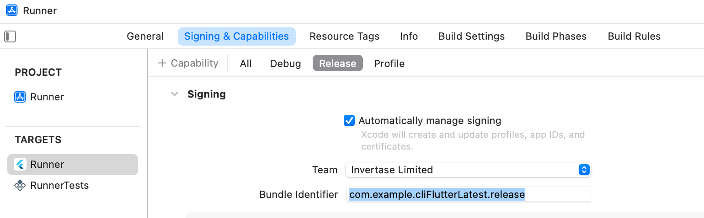

# FlutterFire CLI

<p align="center">
  <a href="https://github.com/invertase/melos#readme-badge"></a>
  <a href="https://invertase.link/discord">
   
 </a>
  <!---<a href="https://docs.page"></a>-->
</p>

<p align="center">
  <a href="https://firebase.google.com/docs/flutter/setup">Documentation</a> &bull; 
  <a href="https://github.com/invertase/flutterfire_cli/blob/main/LICENSE">License</a>
</p>

A CLI to help with using [Firebase](https://firebase.google.com/docs/flutter) in your Flutter applications.

## Local development setup

To set up and use this CLI repo locally for the purposes of contributing, clone it and run the following commands from the root of the repository:

```bash
# Activate CLI from path:
dart pub global activate --source="path" . --executable="flutterfire" --overwrite

# Confirm you now using a local development version:
flutterfire --help
# You should now see a banner printed at the top of the help output similar to:
# ------------------------------------------------------------------
# | You are running a local development version of FlutterFire CLI. |
# ------------------------------------------------------------------
```

## Install

```bash
dart pub global activate flutterfire_cli
```

## Documentation

### Default setup

You may run the following command to configure your Flutter application with Firebase. 

```bash
flutterfire configure
```
This method, at a minimum, will invoke two prompts of the user. A request to specify your Firebase project and
the platforms you wish to configure (i.e. android, iOS, macOS & web). 

If you don't want any prompts, you can use the following command:

```bash
flutterfire configure --yes --project=<FIREBASE_PROJECT_ID>
```
This will auto detect the bundle ID for apple platforms, if there is no existing app associated with the bundle ID in your Firebase console, it will create one, and subsequently write the relevant `GoogleService-Info.plist` file to your project. The same process occurs for your android application ID.

Web is slightly different. It will create a web app in your Firebase console if one is not already present, otherwise, it will select the first one available from your Firebase console.

The `--yes` flag will:
 - auto-detect the platforms from the project directory.
 - prevent a prompt for rewriting the Dart Firebase configuration file (default name - `firebase_options.dart`) should you already have one  in your project.

The `--project` flag will select the Firebase project and negate the command prompt to choose which Firebase project you wish to use.


### Multi build configuration setup

#### Android

[Android Firebase setup](https://firebase.google.com/docs/projects/multiprojects#support_multiple_environments_in_your_android_application) is fairly straight forward. It requires the application ID and the file path where you want to place your `google-services.json` file. Imagine you want to setup you Flutter project's android release build configuration with its own Firebase app. Here is how it would look like:

```
flutterfire configure --platforms=android --android-package-name=your.application.id --android-out=android/app/src/release/google-services.json
```

As we are using the `google-services` gradle plugin to package the `google-services.json` file with your app, you can create as many build types & build flavors you require by following this documentation on [adding the JSON file](https://developers.google.com/android/guides/google-services-plugin#adding_the_json_file). It is simply a case of matching the correct application ID you've associated with a Firebase app in your Firebase console with the correct file path.

 **important**: Use the '--android-package-name' flag otherwise the FlutterFire CLI will auto-detect from your `build.gradle` file.

#### Apple (iOS & macOS)
 
Apple has a couple of different options depending on your project setup. You can configure your Firebase app with Apple platform using either a target or build configuration.

##### build configuration

Most developers will likely configure with build configuration. As default, a Flutter app comes with three different build configurations: `Debug`, `Profile` & `Release`. Unlike android, it does not matter where you write the `GoogleService-Info.plist` file. Here is how to setup your Flutter Apple platform with build configuration:

for iOS:
```
flutterfire configure --platforms=ios --ios-bundle-id=your.bundle.id --ios-build-config=Release --ios-out=ios/release/GoogleService-Info.plist
```

for macOS:
```
flutterfire configure --platforms=macos --macos-bundle-id=your.bundle.id --macos-build-config=Release --macos-out=macos/release/GoogleService-Info.plist
```

##### target configuration

A more advance configuration for developers more experienced with Xcode development would be to utilize multiple targets for their Flutter Apple platform setup. By default, a Flutter app comes with only one target - `Runner`. Once again, it does not matter where you write the `GoogleService-Info.plist` for target configuration. Let's imagine you have created a target for release and called it `ReleaseRunner`. Here is how to setup your Flutter Apple platform with target configuration: 

for iOS:
```
flutterfire configure --platforms=ios --ios-target=ReleaseRunner ios-out=ios/release/GoogleService-Info.plist
```

for macOS:
```
flutterfire configure --platforms=macos --macos-target=ReleaseRunner macos-out=macos/release/GoogleService-Info.plist
```

#### web

Configuration for your Flutter web app occurs via the Dart Firebase configuration file. It is different in the sense that it requires the user to implement the relevant conditions (e.g, debug, release, etc) upon app start up to determine what type of build should use which Firebase app configuration. For example, if you wish to create a Firebase app for your production app, you might do the following:

```
flutterfire configure --platforms=web --web-app-id=<FIREBASE_WEB_APP_ID> --out=lib/firebase_release.dart
```
**IMPORTANT**: The FlutterFire CLI will create only one Firebase web app. If you wish to create more (e.g. For different build environments), you will have to manually create a web app on the Firebase console, and use the Firebase web app ID created to associate with that build type (e.g. debug, release, etc).

In your application code, you might set it up as the following:

```dart
import 'package:flutter/foundation.dart' show kDebugMode;
// Assuming you've previously generated another `firebase_options.dart` file 
import 'firebase_options.dart';
import 'firebase_release.dart' as firebase_release;

Future<void> main() async {
  WidgetsFlutterBinding.ensureInitialized();
  if (kDebugMode) {
    await Firebase.initializeApp(
        options: DefaultFirebaseOptions.currentPlatform,
    );
  } else {
    // Use the Firebase app options from the generated `firebase_release.dart` file
    await Firebase.initializeApp(
      options: firebase_release.DefaultFirebaseOptions.currentPlatform,
    );
  }

  runApp(App());
}
```

### Default Flutter app 
A default Flutter app out of the box has three different build modes; debug, profile and release. If you wished, you can create a Firebase app for each one. 

Imagine you want a debug Firebase app configured for iOS, macOS, android & web, you could run the following:

```bash
flutterfire configure \ 
--yes \
--project=your-project-id \
--platforms=ios,macos,android,web \
--android-out=android/app/src/debug/google-services.json \
--android-package-name=com.example.myapp.debug \
--ios-build-config=Debug \
--ios-out=/ios/debug/GoogleService-Info.plist \
--ios-bundle-id=com.example.myApp.ios.debug \
--macos-build-config=Debug \
--macos-out=/macos/debug/GoogleService-Info.plist \
--macos-bundle-id=com.example.myApp.macos.debug \
--web-app-id=<1:XXX:web:XXX> \
--out=lib/debug/firebase_options.dart
```

Let's create a release build type for your Flutter app, here's how it might look:

```bash
flutterfire configure \ 
--yes \
--project=your-project-id \
--platforms=ios,macos,android,web \
--android-out=android/app/src/release/google-services.json \
--android-package-name=com.example.myapp.release \
--ios-build-config=Release \
--ios-out=/ios/release/GoogleService-Info.plist \
--ios-bundle-id=com.example.myApp.ios.release \
--macos-build-config=Release \
--macos-out=/macos/release/GoogleService-Info.plist \
--macos-bundle-id=com.example.myApp.macos.release \
--web-app-id=<1:XXX:web:XXX> \
--out=lib/release/firebase_options.dart
```

**Important things to note with multi-environment set up** 
- The android gradle plugin will try to match the path `google-services.json` to the correct build type. For instance, debug build will find the service file in the following locations: `android/app/src/debug/google-services.json` or `android/app/google-services.json`.
- Required to configure the application ID for release build in your android `build.gradle`. This might look like the following:
```gradle
buildTypes {
    release {
        signingConfig signingConfigs.debug
        // This will effectively app the suffix to your applicationId. e.g. "com.example.myapp.release"
        applicationIdSuffix ".release"
    }
}
```
- Required to configure the bundle ID for release build configuration in Xcode for macOS & iOS `build.gradle` under "Signings and Capabilities" tab. Below is an image of where you can update the release build configuration bundle ID:

- Required to manually create a Firebase web app for release and use the Firebase web App ID as an argument for `--web-app-id`.
- Required to implement your own logic for configuring build type for your Flutter web app as mentioned above.

If you require further granular builds i.e. build flavors, you can refer to [this article](https://codewithandrea.com/articles/flutter-flavors-for-firebase-apps/) which demonstrates how to configure different build flavors using [VGV CLI](https://github.com/VeryGoodOpenSource/very_good_cli) to create a Flutter app that has build flavors out of the box. 

### Flutterfire reconfigure
There is another command that you might want to run each time you configure your project with another Firebase product. For example, if you configure Real time database for your Firebase project, you will be required to reinstall every service file for each platform. By running,

```
flutterfire reconfigure
```
It will rewrite all your service files in place and your Dart initialization file. It does this by using the `firebase.json` to track each of your configurations to update the service file at the correct location.

### Further recommendation
- Use the Firebase service files for android (`google-services.json`), iOS & macOS (`GoogleService-Info.plist`). [See this comment](https://github.com/invertase/flutterfire_cli/issues/14#issuecomment-1270781026) for further information why we don't recommend Dart initialization for these platforms.

---

<p align="center">
  <a href="https://invertase.io/?utm_source=readme&utm_medium=footer&utm_campaign=flutterfire_cli">
    
  </a>
  <p align="center">
    Built and maintained by <a href="https://invertase.io/?utm_source=readme&utm_medium=footer&utm_campaign=flutterfire_cli">Invertase</a>.
  </p>
</p>
